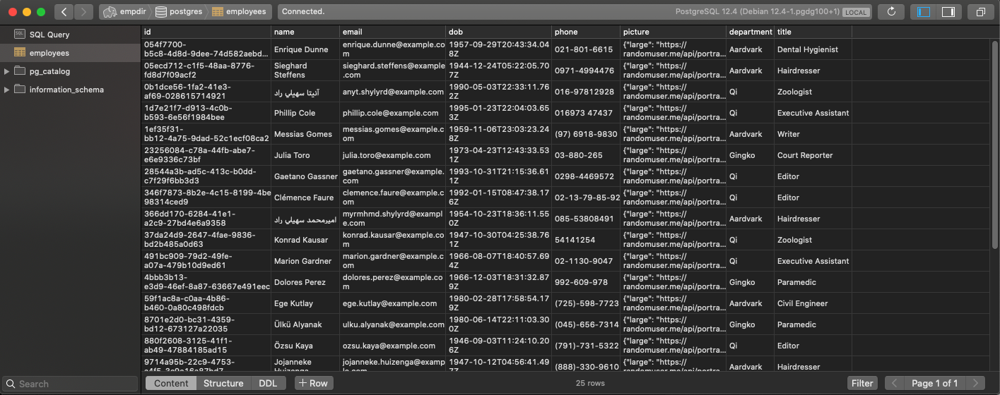
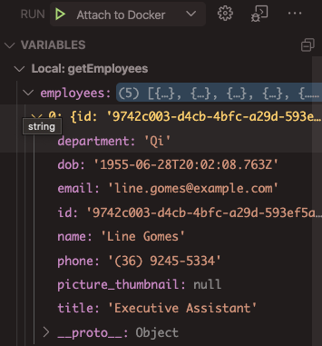
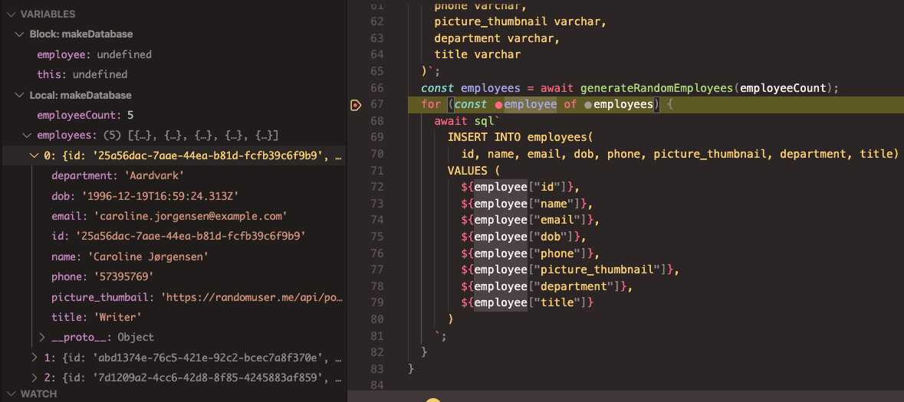

# Planning

    ```
    Frontend
    * Bundling: Snowpack
    * UI framework: React Bootstrap
    * View framework: React
    * JavaScript runtime: Node.js
    * Animation: Framer Motion
      <motion.div
          animate={{
          x: 26,
          y: -84,
          scale: 0.5,
          rotate: 86,
      }}
    />
    * TypeScript or JavaScript: JavaScript. Faster to prototype w/out types + haven’t written a whole app in JS, since I started with TS at Expedia.
    * Testing: Jest

    Backend
    * Web framework: expressjs
    * Database: PostreSQL (because Heroku has a free db)
    * API: GraphQL

    Requirements
    * List employees
    * Filter employees by name, email, department, title
    * Add employee
    * Update employee
    * Delete employees
    ```

Developer Diary

## 2020-09-02

1. I need a database. Installed [docker](https://hub.docker.com/editions/community/docker-ce-desktop-mac/)
2. Pull the postgres image
   ```
   docker pull postgres
   ```
3. Start postgres. Refer to the app as empdir because I don't like typing long names
   ```
   docker run --name empdir -e POSTGRES_PASSWORD=empdir postgres
   ```
4. Realize I'll want to run the db, frontend, and backend service in Docker. Let's use [docker-compose](https://github.com/docker/compose). Here's a [tutorial](https://medium.com/@wkrzywiec/how-to-run-database-backend-and-frontend-in-a-single-click-with-docker-compose-4bcda66f6de).
5. Need a github repo to store this all in. Created https://github.com/bgoosman/empdir

   ```
   ➜  employee-directory git:(master) ✗ cat docker-compose.yml
   version: "3.8"
   services:
     db:
       image: postgres
       restart: always
       environment:
         POSTGRES_PASSWORD: empdir

     adminer:
       image: adminer
       restart: always
       ports:
         - 8080:8080
   ➜  employee-directory git:(master) ✗ docker-compose up
   ```

6. I need a database model. https://randomuser.me/ provides a lot of data, but I'm only interested in name, email, dob, phone, id, and picture. The challenge recommends adding department and title to that. We can generate those randomly during ingest. It's easy to generate one user:`GET 'https://randomuser.me/api/'`. We'll create 5,000 to stay in Heroku's free tier and choose department (Aardvark, Gingko, Qi) and title https://www.randomlists.com/random-jobs?dup=false&qty=40. Let's generate that dataset.

## 2020-09-03

7. Created scripts/make-database.js. Use the [postgres module](https://github.com/porsager/postgres) and [axios](https://github.com/axios/axios) to simultaneously create random users and then store them.

   ```
   const axios = require("axios");
   const postgres = require("postgres");

   async function getRandomUsers(count) {
     try {
       const response = await axios.get(
         `http://randomuser.me/api/?results=${count}`
       );
       return response.data.results;
     } catch (error) {
       console.error(error);
     }
   }

   const departments = {
     Aardvark: ["Dental Hygienist", "Civil Engineer", "Writer", "Hairdresser"],
     Gingko: [
       "Insurance Agent",
       "Court Reporter",
       "Paramedic",
       "Real Estate Agent",
     ],
     Qi: ["Editor", "Executive Assistant", "Zoologist", "Plumber"],
   };
   const departmentKeys = Object.keys(departments);

   function userToEmployee(user) {
     const randomDepartment =
       departmentKeys[(departmentKeys.length * Math.random()) << 0];
     const titles = departments[randomDepartment];
     const randomTitle = titles[(titles.length * Math.random()) << 0];
     return {
       id: user["login"]["uuid"],
       name: `${user["name"]["first"]} ${user["name"]["last"]}`,
       email: user["email"],
       dob: user["dob"]["date"],
       phone: user["phone"],
       picture: user["picture"],
       department: randomDepartment,
       title: randomTitle,
     };
   }

   async function generateRandomEmployees(employeeCount) {
     const users = await getRandomUsers(employeeCount);
     const data = [];
     for (let i = 0; i < users.length; i++) {
       data.push(userToEmployee(users[i]));
     }
     return data;
   }

   export async function makeDatabase(employeeCount) {
     const sql = postgres();
     await sql`DROP TABLE employees`;
     await sql`CREATE TABLE employees (
       id varchar PRIMARY KEY,
       name varchar,
       email varchar,
       dob varchar,
       phone varchar,
       picture jsonb,
       department varchar,
       title varchar
     )`;
     const employees = await generateRandomEmployees(employeeCount);
     for (const employee of employees) {
       await sql`
         INSERT INTO employees(
           id, name, email, dob, phone, picture, department, title)
         VALUES (
           ${employee["id"]},
           ${employee["name"]},
           ${employee["email"]},
           ${employee["dob"]},
           ${employee["phone"]},
           ${sql.json(employee["picture"])},
           ${employee["department"]},
           ${employee["title"]}
         )
       `;
     }
   }
   ```

8. I want to run all of this in a docker container, and knowing this backend folder will be a Node app, I followed [these instructions](https://nodejs.org/en/docs/guides/nodejs-docker-webapp/). This also allows us to quickly set [magic env variables that postgres js uses](https://github.com/porsager/postgres#environment-variables-for-options). Since this is all going in GraphQL anyway, let's add a route to the GraphQL server just for making the database. In src/server.js:

   ```
   import { GraphQLServer } from "graphql-yoga";

   const typeDefs = `
     type Query {
       hello(name: String): String!
     }
   `;

   const resolvers = {
     Query: {
       hello: (_, { name }) => `Hello ${name || "World"}`,
     },
   };

   const server = new GraphQLServer({ typeDefs, resolvers });
   server.start(() => console.log("Server is running on localhost:4000"));

   server.express.route("/make-database", () => {
     try {
       await makeDatabase(5);
       res.send("Done!");
     } catch (e) {
       res.send(e);
     }
   });
   ```

   We need esm to use ECMAScript modules, so install that first `npm i esm --save`. Now create the backend/Dockerfile

   ```
   FROM node:12

   WORKDIR /usr/src/app

   COPY package*.json ./

   RUN npm install

   COPY . .

   EXPOSE 3030

   CMD [ "node", "-r", "esm", "src/server.js" ]
   ```

   Now we can run our server, but first add this to docker-compose.yml.

   ```
   backend:
    image: bgoosman/employee-directory-backend
    environment:
      PGHOST: host.docker.internal
      PGPORT: 5432
      PGUSER: postgres
      PGPASSWORD: employee-directory-postgres-password
    ports:
      - 4000:4000
   ```

   ```
   ➜  backend git:(master) ✗ pwd
   /Users/admin/code/employee-directory/backend
   ➜  backend git:(master) ✗ cd ..
   ➜  employee-directory git:(master) ✗ docker build -t bgoosman/employee-directory-backend ./backend && docker-compose up
   ...

   ```

   Execute a GET http://localhost:4000/make-database.
   

## 2020-09-04

1. I got sick of rebuilding my docker containers for every code change. Fortunately [there is hope](https://medium.com/better-programming/docker-in-development-with-nodemon-d500366e74df). I added the following to my backend service in docker-compose.yml.
   ```
   command: npx nodemon -r esm src/server.js
   ...
   volumes:
     - ./backend:/usr/src/app
   ```
   Fresh air:
   ```
   backend_1  | [nodemon] restarting due to changes...
   backend_1  | [nodemon] starting `node -r esm src/server.js`
   backend_1  | Server is running on localhost:4000
   ```
   And, the stack now stops with only one Ctrl-C. :)
2. Need to get employees. [GitHub](https://github.com/bgoosman/employee-directory/commit/50224a62efb1a97ee939f8eab7d0236774cfdd4d)
3. Let's figure out how to [debug Node](https://github.com/microsoft/vscode-recipes/tree/master/nodemon) in a [docker container](https://github.com/microsoft/vscode-recipes/tree/master/Docker-TypeScript) first. Discovered our picture_thumbnail was null. Oops. [GitHub](https://github.com/bgoosman/employee-directory/commit/245a244f9506b70f60d8bf0466f5b542a0e88314)

   

   

   Ah, I mispelled the mapping code: `picture_thumbail: user["picture"]["thumbnail"],` [GitHub](https://github.com/bgoosman/employee-directory/commit/1f40598a532d74489d08a0ecc2b3316b36cef061)

   Now we can query for employees!

   ```
   query {
     employees {
       id
       name
       email
       dob
       phone
       picture_thumbnail
       department
       title
     }
   }
   Response:
   {
    "data": {
      "employees": [
        {
          "id": "eaf98d6b-7b59-406f-8fe9-264ab60d61e9",
          "name": "Tjitse Slots",
          "email": "tjitse.slots@example.com",
          "dob": "1965-12-22T15:52:39.108Z",
          "phone": "(730)-840-9679",
          "picture_thumbnail": "https://randomuser.me/api/portraits/thumb/men/66.jpg",
          "department": "Gingko",
          "title": "Real Estate Agent"
        },
        ...
   ```

4. Need to filter employees by name, email, title, or department. Add a test framework at the same time. [GitHub](https://github.com/bgoosman/employee-directory/commit/5241877bb2ad9769d79b876d3db305a5e0baa5ba)

   Sources:

   - [Mutations and Input Types](https://graphql.org/graphql-js/mutations-and-input-types/)
   - [How to pass variables in GraphiQL](https://atheros.ai/blog/graphql-quick-tip-how-to-pass-variables-in-graphiql)
   - [mochajs, a test framework](https://mochajs.org/)
   - [If you want test spies: sinonjs](https://sinonjs.org/#get-started)
   - [The Ultimate Unit Testing Cheat-sheet for Mocha, Chai, and Sinon](https://gist.github.com/yoavniran/1e3b0162e1545055429e#sinon)
   - [If you want expect() asserts: Chai](https://www.chaijs.com/)
   - [How to export multiple functions the ES6 way](https://stackoverflow.com/questions/38296667/getting-unexpected-token-export)

5. Add code coverage with [c8](https://github.com/bcoe/c8#readme). I tried nyc but it doesn't support the import module syntax. [GitHub](https://github.com/bgoosman/employee-directory/commit/2a155bf2b553b69a479b22d97512b35591e17d76)

## 2020-09-05

6. Adding a mutation to create an employee next. [GitHub](https://github.com/bgoosman/employee-directory/commit/46e632c3a9dc8ce3c0edaa173c842a5a7d2bd688)

7. Need to update an employee. [GitHub](https://github.com/bgoosman/employee-directory/commit/ca46d175620e29b07261b0cfea6d3a3ce3da8f4c)

   ```
   mutation updateEmployee($input: UpdateEmployeeInput!) {
     updateEmployee(input: $input) {
       id
       name
       email
       dob
       phone
       picture_thumbnail
       department
       title
     }
   }
   Query variables:
   {
     "input": {
       "id":"782750f3-45dc-4698-b942-fefea288b72d",
         "name": "Joseph Joestar!",
         "email": "j.j@ba.com",
         "dob": "1957-08-14T14:14:11.800Z",
         "phone": "111-111-1111",
         "picture_thumbnail": "https://randomuser.me/api/portraits/thumb/men/48.jpg",
         "department": "Qi",
         "title": "Joestar"
       }
   }
   ```

   Sources

   - [How to expect an async exception in Mocha/Chai](https://stackoverflow.com/questions/45466040/verify-that-an-exception-is-thrown-using-mocha-chai-and-async-await)
   - [Chai as Promised](https://www.chaijs.com/plugins/chai-as-promised/)
   - [Sinon fakes that return mock values](https://sinonjs.org/releases/latest/fakes/)
   - [Throwing errors in GraphQL](https://dev.to/andre/handling-errors-in-graphql--2ea3)
   - [Argument spreading in JS](https://2ality.com/2011/08/spreading.html)

8. Need to delete an employee.

   ```
   mutation deleteEmployee($input: DeleteEmployeeInput!) {
     deleteEmployee(input: $input) {
       count
     }
   }
   Query variables:
   {
     "input":{
       "id":"782750f3-45dc-4698-b942-fefea288b72d"
     }
   }
   Response #1:
   {
     "data": {
       "deleteEmployee": {
         "count": 1
       }
     }
   }
   Response #2:
   {
     "data": {
       "deleteEmployee": {
         "count": 0
       }
     }
   }
   ```

   Our test run so far:

   ```
   ➜  backend git:(master) ✗ npm test

   > backend@1.0.0 test /Users/admin/code/employee-directory/backend
   > npx c8 mocha -r esm --recursive


     getStringFilter
       ✓ should return a valid prefix search sql

     getEmployees
       ✓ uses all the filters

     createEmployee
       ✓ returns an employee with a unique id
       ✓ uses all the input args

     updateEmployee
       ✓ returns the employee
       ✓ updates all the input args except the primary key
       ✓ throws an error if no update occurred

     deleteEmployee
       ✓ returns the count of employees deleted
       ✓ uses the input id


     9 passing (19ms)

   ------------------|---------|----------|---------|---------|-------------------
   File              | % Stmts | % Branch | % Funcs | % Lines | Uncovered Line #s
   ------------------|---------|----------|---------|---------|-------------------
   All files         |     100 |      100 |     100 |     100 |
   employee-crud.js |     100 |      100 |     100 |     100 |
   ------------------|---------|----------|---------|---------|-------------------
   ```

9. If I'm going to be searching through thousands of employees, I'll need pagination. The GraphQL site [recommends a cursor approach](https://graphql.org/learn/pagination/). Limit / offset could work but [it doesn't scale](https://www.citusdata.com/blog/2016/03/30/five-ways-to-paginate/). The link above suggests "keyset pagination". The getEmployees query should accept `after` and `limit` arguments. The getEmployees query will return at most `limit` employees after the `after` cursor. The cursor will identify the last entity in a page. The cursor will be a combination of the values of all the currently sorted columns. For example, by default we will sort by `name` ascending. Then, `getEmployees(after: $cursor, limit: 10)` will return the first ten results of this query:

   ```
   # Get first ten employees after and not including name = $cusor
   getEmployees(after: $cursor, limit: 10):
   select * from employees
   where name > $cursor
   order by name asc

   # Get first ten employees ordered by name
   getEmployees(limit: 10)
   select * from employees
   order by name asc
   ```

   Until we support sorting by other columns, we can stick to using the name as a cursor.

   ```
   # This query returns the first employee after the one named "Adalgisa Rodrigues"
   query getEmployees($filter:FilterInput) {
     employees(filter:$filter, first:1, after:"Adalgisa Rodrigues") {
       id
       name
       email
       dob
       phone
       picture_thumbnail
       department
       title
     }
   }
   ```

   We'll need the total count of employees, the last cursor in the current page, and a boolean hasNextPage to enable pagination.

   ```
   query getEmployees($filter:FilterInput){
     employees(filter:$filter, first:5, after:"Christoffer Christiansen"){
       totalCount
       edges {
         node {
           id
           name
           email
           dob
           phone
           picture_thumbnail
           department
           title
         }
         cursor
       }
       pageInfo {
         endCursor
       }
     }
   }
   ```

## 2020-09-06

1. The backend satisfies our requirements, so we can finally move onto the frontend. I want to try [Snowpack](https://www.snowpack.dev/) for its promises of fast unbundled development.

   ```
   npx create-snowpack-app frontend --template @snowpack/app-template-react
   npx snowpack dev
   ```

   

   ```
   # 1. Create a Dockerfile for the frontend
   # 2. Add this to docker-compose.yml
   # 3. App will reload on any file change!
   frontend:
     image: bgoosman/employee-directory-frontend
     command: npx snowpack dev
     ports:
       - 8181:8181
     volumes:
       - ./frontend:/usr/src/app
   ```

2. We want to provide UI for all of these

   - Paginated list of employees
   - Filter by name, email, title, department
   - Create an employee
   - Update an employee
   - Delete an employee

   Finishing the first will get our project mostly setup to solve the others. Eventually, we also want to make it look stylish and animative. Starting with a UI framework will save us time later. I'm looking for something with

   - ready-to-use React components
   - built-in accessibility

   I'm already using [Material UI](https://material-ui.com/) on a different side project, so my pick here is [React Bootstrap](https://react-bootstrap.github.io/). I also considered [Ant Design](https://ant.design/), [Blueprint](https://blueprintjs.com/), [Reach UI](https://reach.tech/), [Bootstrap v5 alpha](https://blog.getbootstrap.com/2020/06/16/bootstrap-5-alpha/), [Fluent UI](https://developer.microsoft.com/en-us/fluentui), and [Reakit](https://reakit.io/). React Bootstrap promises accessibility out of the box and comes with the full functionality of the Bootstrap framework, which means we get grid layout and a bunch of UI components. Material UI / Blueprint / Ant Design seem nice but perhaps overkill for this app.

   ```
   ➜  frontend git:(master) ✗ npm install react-bootstrap bootstrap
   ```

   Testing React components: [react-testing-library](https://github.com/testing-library/react-testing-library). React Testing Library is a replacement for Enzyme.

   ```
   ➜  frontend git:(master) ✗ npm install --save-dev @testing-library/react
   ```

   Animations: [Framer Motion](https://www.framer.com/motion/)

   ```
   ➜  frontend git:(master) ✗ npm install framer-motion
   ```

   GraphQL client: [Apollo](https://www.apollographql.com/docs/react/get-started/)

   ```
   ➜  frontend git:(master) ✗ npm install @apollo/client graphql
   ```

   Client side router: [react-router-dom](https://reactrouter.com/web/guides/quick-start)

   ```
   ➜  frontend git:(master) ✗ npm install react-router-dom
   ```

   State container: [MobX](https://mobx.js.org/README.html)

   ```
   ➜  frontend git:(master) ✗ npm install mobx
   ```
